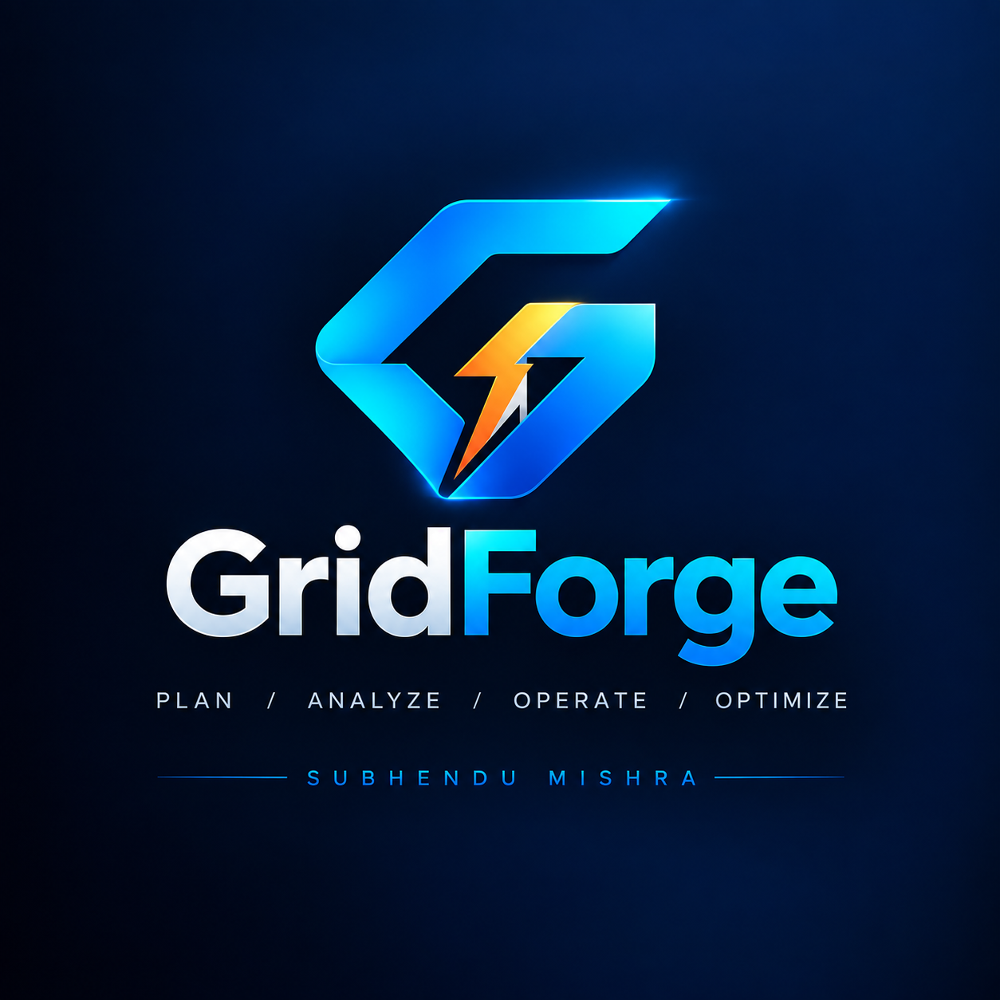
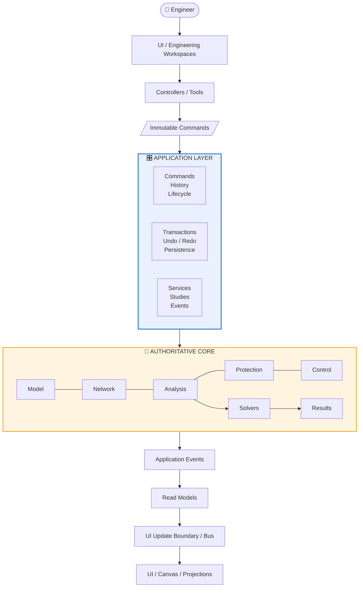
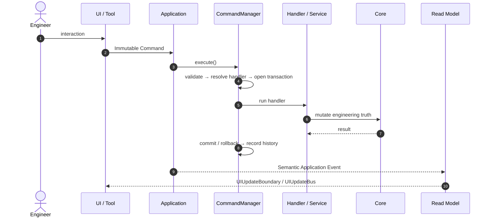
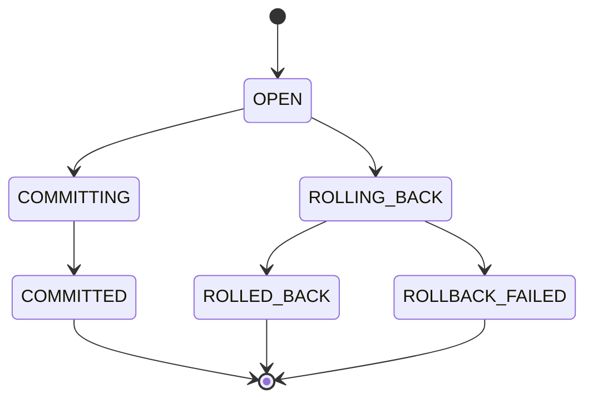
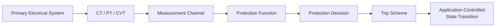
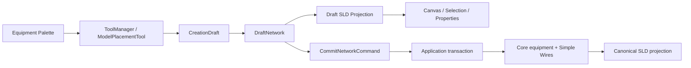
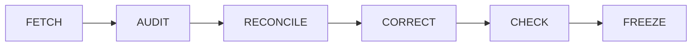

<p align="center">
  
</p>

<h1 align="center">⚡ GridForge V2</h1>

<p align="center">
  <b>Power-System Digital Twin · Engineering · Simulation · Automation</b>
</p>

<p align="center">
  <i>By Engineers. For Engineers.<br>One Platform. Infinite Engineering Possibilities.</i>
</p>

<p align="center">
  
  
  
  
</p>

<p align="center">
  <b>Author:</b> Subhendu Mishra
</p>

<p align="center">
  <a href="#-what-is-gridforge">Overview</a> ·
  <a href="#-architecture-at-a-glance">Architecture</a> ·
  <a href="#-the-mutation-pipeline">Pipeline</a> ·
  <a href="#-engineering-domains">Domains</a> ·
  <a href="#-repository-structure">Structure</a> ·
  <a href="#-architectural-rules">Rules</a> ·
  <a href="#-testing-philosophy">Testing</a>
</p>

---

## 🌐 What is GridForge?

**GridForge** is a Python-based power-system engineering platform for **creating, editing, validating, studying, simulating, documenting, and operating** digital representations of electrical power systems.

It is a **one-stop engineering environment for power-system engineers**, built on strict separation between:

| | | |
|---|---|---|
| 🧠 Engineering truth | 🎛️ Application orchestration | 🖱️ User interaction |
| 🎨 Graphical presentation | 📊 Studies & solvers | 🛡️ Protection |
| 🤖 Control & automation | 🌊 Dynamics | 💾 Persistence |
| 🔌 Plugins | 📄 Engineering documentation | |

> [!IMPORTANT]
> **GridForge V2 is not an SLD-only application.** The Single-Line Diagram is just *one* engineering projection of the underlying digital twin.

---

## 🏛️ Architecture at a Glance

> **Core owns engineering truth. Application owns orchestration. UI owns interaction and presentation.**



### One truth, three responsibilities

| Layer | Role | Owns |
|:---:|---|---|
| 🧠 **Core** | *Engineering Truth* | Model · Network · Topology · Terminals · Connections · Identities · Validation · Analysis · Protection · Measurement · Control · Dynamics · Studies · Solvers · Results |
| 🎛️ **Application** | *Orchestration* | Commands · Handlers · Transactions · Rollback/Commit · History · Undo/Redo · Lifecycle · Persistence · Study orchestration · Services · Events · Read models |
| 🖥️ **UI** | *Interaction & Presentation* | Widgets · Canvas · Rendering · Selection · Workspace state · Projections |

> [!NOTE]
> The **Core is headless** — no Qt, no QGraphics, no widgets, no canvas state, no UI controllers. The Application layer may call Core; Core never calls UI.

### ❌ What must never become a second engineering model

`The UI` · `The SLD` · `A renderer` · `A plugin`

---

## 🔁 The Mutation Pipeline

Every change to the engineering model follows a single, auditable path:



### CommandManager responsibilities

`1 Receive` → `2 Validate` → `3 Resolve handler` → `4 Open transaction` → `5 Execute` → `6 Commit / Roll back` → `7 Record history` → `8 Support undo/redo`

> [!TIP]
> **Failure invariant:** a failed command must never leave a partially mutated system — `S₀ → failed command → S₀`.

### Transaction lifecycle



### Commands & events

<table>
<tr>
<td valign="top" width="50%">

**📝 Immutable Commands**

`CreateBus` · `CreateTransformer` · `CreateBreaker` · `CreateLine` · `ConnectTerminals` · `UpdateEquipment` · `DeleteEquipment` · `PlaceEquipment` · `RunStudy` · `SaveProject` · `OpenProject` · `CloseProject`

Commands **never** manipulate widgets, bypass Application, or expose mutable Core state to UI code.

</td>
<td valign="top" width="50%">

**📣 Application Events**

`ElementCreated` · `ElementUpdated` · `ElementRemoved` · `TopologyChanged` · `ProjectLoaded` · `ProjectSaved` · `ProjectClosed` · `StudyStarted` · `StudyCompleted` · `ValidationChanged`

</td>
</tr>
</table>

---

## ⚙️ Engineering Domains

<details open>
<summary><b>🔌 Terminals, Connections & Topology</b></summary>

- **Terminals** are first-class engineering objects — electrical endpoints owned by their equipment, and the basis for connectivity, topology, and switching interpretation.
- **Connections & topology** are derived from authoritative terminal relationships via `TopologyManager`.
- **Graphical position does not establish electrical connectivity** unless the corresponding engineering relationship exists.
- A **Bus** is an authoritative engineering object with its own identity — not merely a graphical line, and not a generic derived topological node.

</details>

<details>
<summary><b>📊 Analysis · Power Flow · Short Circuit</b></summary>

```
Study / Engineering Analysis  →  Numerical Solver  →  Results
```

Power Flow lives under `core.analysis`. Short-circuit analysis consumes authoritative network and equipment data **without owning the model**.

</details>

<details>
<summary><b>🌊 Dynamics</b></summary>

A first-class study domain organized under `core/solver/dynamics/`. Dynamic initialization may use an operating point from a solved static study — but the dynamic model must **never silently replace** the persistent electrical truth.

</details>

<details>
<summary><b>🛡️ Protection</b></summary>



Protection decisions (`relay_id`, `function_code`, `function_id`, `decision`) remain **distinct from physical switching state**.

</details>

<details>
<summary><b>🤖 Control & Automation</b></summary>

Digital I/O, analog signals, timers, interlocks, ladder logic, and control sequences — all interacting with the model **only** through defined Application/domain interfaces.

</details>

---

## 🖼️ SLD Architecture

The Single-Line Diagram is a **presentation and authoring projection** — never the authoritative electrical model.

Current SLD state is separated into three conceptual levels:

```
SLDDocument
    ↓
SLDCanvasProjection
    ↓
Immutable canvas snapshot
    ↓
SemanticPresentationRealization
    ↓
SLDGraphicsItemFactory
    ↓
QGraphicsItem
```

The graphics layer consumes persistent/presentation state. Runtime QGraphics objects are disposable and are never the project persistence authority.

### Draft-first placement workflow



**Placement does not create Core equipment by itself.** Draft equipment and draft connections remain authoring state until the explicit commit boundary.

> [!WARNING]
> **Graphical snapping is not electrical connectivity.** A wire becomes engineering state only through the canonical Application command/service path.

### Transactional SLD graphics

Persistent presentation state follows:

```
SLDDocument
    ↓
SLDCanvasProjection
    ↓
immutable canvas snapshot
    ↓
QGraphics presentation
```

A graphics edit must not silently mutate persistent SLD state. Presentation edits are transaction/history-visible and are re-projected after undo/redo.

---

## 🔌 Plugin Architecture

Plugins may contribute **equipment types · studies · canvases · tools · panels · renderers · reports · domain extensions** — but communicate exclusively through defined Core/Application contracts.

> A plugin is **an extension of GridForge, not an alternative architecture.**

---

## 💾 Persistence Architecture

GridForge now uses a **canonical, migration-aware persistence boundary**.

The authoritative load path is:

```
Raw .gridforge package
        ↓
Package / version detection
        ↓
Schema migration
        ↓
Canonical current representation
        ↓
Structural validation
        ↓
LoadedProject
        ↓
Application activation
        ↓
SLD document rehydration
        ↓
Canvas projection
```

Canonical project package:

```
project.gridforge/
├── manifest.json
└── project.json
```

Historical formats are migrated before the rest of the application consumes them. The SLD representation has a canonical schema and deterministic serialization/rehydration contract.

### Multi-SLD persistence

The persisted project represents the **complete SLD document collection**, not only the currently active SLD:

```
Project
  ↓
DocumentManager
  ↓
SLD Document Collection
  ├── Document A
  ├── Document B
  └── ...
```

Runtime document creation, activation, ordering and removal must remain synchronized with the persisted presentation collection.

### Reopen integrity

Reopen reconstructs runtime presentation from persisted state:

```
Persisted SLD
    ↓
Migration
    ↓
SLDDocument.from_dict()
    ↓
runtime SLDDocument / SLDModel
    ↓
DocumentManager
    ↓
SLDCanvasProjection
    ↓
immutable canvas snapshot
    ↓
QGraphics presentation
```

Reopen/activation audits are read-only with respect to persisted SLD presentation state. Loading must not mutate the persisted document merely because it was opened.

> Runtime Qt and QGraphics objects are **never** persisted as project truth. Persistence stores semantic engineering state and canonical presentation state.

---

## 📁 Repository Structure

The current repository uses a headless Core plus an Application boundary under Core, with UI as the interaction/presentation layer.

~~~text
GridForge/
│
├── core/                         Authoritative, headless engineering truth
│   ├── base/                     Domain primitives and shared contracts
│   ├── model/                    Equipment, terminals, identities, properties
│   ├── network/                  Canonical network membership/connectivity
│   ├── topology/                 Canonical derived electrical topology
│   ├── numerical/                Derived numerical representations
│   ├── analysis/                 Engineering-study domain
│   ├── solver/                   Numerical solvers
│   │   ├── common/
│   │   ├── power_flow/
│   │   ├── short_circuit/
│   │   ├── contingency/
│   │   └── dynamics/
│   ├── measurement/              Measurement domain
│   ├── protection/               Protection domain
│   ├── control/                  Control domain
│   ├── validation/               Engineering/domain validation
│   ├── results/                  Study/solver results
│   ├── simulation/               Headless simulation execution
│   └── application/              Semantic UI↔Core boundary
│       ├── commands/              Immutable command definitions
│       └── services/              Application workflow services
│
├── ui/                           Interaction, presentation and projection
│   ├── core/                     Shared UI infrastructure
│   ├── canvas/                   Canvas contracts and scene presentation
│   ├── controllers/              UI/Application coordination
│   ├── items/                    Graphics realization objects
│   ├── panels/                   Inspectors, explorers and engineering panels
│   ├── plugins/                  UI extension integration
│   ├── renderers/                Presentation rendering
│   ├── tools/                    User interaction tools
│   └── sld/                      Single-Line Diagram authoring/projection
│
└── README.md                     Architecture entry point
~~~

Only directories that exist in the current implementation are documented here. Folder-level README.md files describe responsibility and boundary; they do not introduce alternate authorities.

---

## 📜 Architectural Rules

| # | Rule | # | Rule |
|:-:|---|:-:|---|
| 1 | **Core is authoritative** — one engineering model | 9 | **Qt stays out of Core** — Core remains headless |
| 2 | **Application is the UI↔Core boundary** | 10 | **Persistence stores canonical semantics**, not UI objects |
| 3 | **Commands are immutable** | 11 | **Topology is derived** from engineering relationships |
| 4 | **Transactions are explicit** — commit/rollback | 12 | **Protection decisions ≠ switching state** |
| 5 | **Undo/redo belong to Application** | 13 | **Studies are Application-orchestrated** |
| 6 | **SLD is a projection/authoring surface**, not truth | 14 | **Read models are not Core** |
| 7 | **Graphics are realization objects**, not persistence authority | 15 | **Draft placement does not mutate Core** |
| 8 | **Plugins use contracts** — no bypassing Application | 16 | **Draft → Core occurs only through explicit commit** |
| | | 17 | **Multi-SLD persistence represents the complete document collection** |
| | | 18 | **Reopen rehydrates without mutating persisted SLD state** |
| | | 19 | **Presentation revisions do not masquerade as topology revisions** |
| | | 20 | **No historical/parallel architecture is reintroduced** |

---

## 🚫 Forbidden Architectural Paths

```
❌  UI ───────────────► Core mutation
❌  SLD ──────────────► Core mutation
❌  Renderer ─────────► Core mutation
❌  Controller ───────► Core mutation
❌  Plugin ───────────► uncontrolled Core mutation
❌  Core ─────────────► Qt / UI
❌  Solver ───────────► independent engineering truth
❌  SLD geometry ─────► authoritative topology
❌  UI history ───────► independent undo/redo
```

---

## 🗂️ Engineering State Ownership

| Concern | Owner |
|---|:-:|
| Equipment identity & properties | 🧠 Core |
| Terminals · Connections · Topology | 🧠 Core |
| Domain validation & numerical calculations | 🧠 Core |
| Study orchestration | 🎛️ Application |
| Command execution · Transactions | 🎛️ Application |
| Undo/redo · Project lifecycle | 🎛️ Application |
| Persistence orchestration · Events · Read models | 🎛️ Application |
| UI interaction · Rendering · Selection | 🖥️ UI |
| Canvas geometry · User workspace state | 🖥️ UI / Projection |
| Plugin contributions | 🔌 Plugin *(via contracts)* |

---

## 🧭 Current Implementation Status

The current mainline architecture includes the completed persistence/SLD corrections through **#27E**, the draft/commit lifecycle, canonical connectivity, and the current electrical-equipment insertion workflow.

### Implemented architectural areas

- **#27A — Canonical Persistence Schema & Migration**
  - migration at the persistence boundary;
  - canonical current representation;
  - structural validation before Application activation.

- **#27B — Canonical SLD Schema & Serializer Fidelity**
  - canonical SLD representation;
  - deterministic serialization;
  - lossless supported round-trip semantics.

- **#27C / #27C-final — SLD Rehydration & Reopen Integrity**
  - canonical SLD document rehydration;
  - projection ownership;
  - restoration of all persisted SLD documents;
  - active presentation restoration;
  - read-only reopen/activation auditing.

- **Multi-SLD lifecycle**
  - `DocumentManager` is the runtime document registry;
  - persistence represents the complete document collection;
  - activation is not a substitute for the complete project presentation state.

- **Draft-first authoring / commit lifecycle**
  - `DraftNetwork`;
  - `DraftEndpointReference`;
  - draft equipment and draft connections;
  - `AddDraftEquipmentCommand`;
  - `UpdateDraftEquipmentCommand`;
  - explicit `CommitNetworkCommand`;
  - `CreationCommitIntent`;
  - endpoint resolution and deterministic draft→Core identity mapping;
  - transactional Core creation followed by Simple Wire creation and canonical SLD projection.

- **Canonical connectivity**
  - `ConnectivityResolver`;
  - canonical terminal/BUS endpoint identity;
  - `SimpleWireConnectionService`;
  - Application-controlled wire creation/removal;
  - topology events and revision semantics.

- **Electrical equipment insertion into existing Simple Wires**
  - existing-equipment drag/insertion workflow through `SelectTool` / `ElectricalInsertionTool`;
  - immutable `InsertEquipmentIntoConnectionCommand`;
  - `ElectricalInsertionService` as the transactional Application service;
  - canonical terminal endpoint synchronization through `ConnectTerminalCommand` / `EndpointResolver`;
  - topology-preserving Simple Wire splitting;
  - exact preservation of authored SLD route/presentation ownership and node metadata;
  - rollback-safe cancellation and failed insertion behavior.

- **#27E — Transactional SLD Graphics**
  - graphics consume immutable canvas snapshots;
  - persistent SLD presentation state is not owned by QGraphics objects;
  - presentation edits participate in transaction/history semantics;
  - undo/redo re-projects persistent state rather than relying on stale graphics state.

### Verification status

These corrections have primarily been validated through repository/static architectural reconciliation. This README intentionally does **not** claim complete GUI/runtime verification, pytest closure, or CI closure unless those have been explicitly executed and recorded.

The frozen architecture remains:

```
Core
  ↓
Application
  ↓
Commands / Transactions / Events / Read Models
  ↓
SLD / UI Projections
```

No parallel Core, topology, CommandManager, Transaction, SelectionManager, EventBus, persistence authority, or SLD engineering authority should be introduced.

---

## 🧪 Testing Philosophy

| Area | Coverage |
|---|---|
| 🧠 **Core Domain** | Model · Network/Topology · Analysis · Solver · Protection · Control · Dynamics |
| 🎛️ **Application** | Command · Transaction · History · Undo/Redo · Lifecycle · Persistence · Event |
| 🖥️ **UI / Integration** | Projection · Workflow Integration · Architecture Boundary · Regression |

Every major workflow — *create / edit / delete equipment, connections, undo/redo, save / open / close, run study, protection trip, control action, dynamic simulation* — requires **explicit contract coverage** of the complete path, not just isolated classes.

> [!CAUTION]
> A passing numerical solver does **not** prove that the complete engineering workflow works.

---

## 🧭 Development Philosophy

| Principle | Meaning |
|---|---|
| ⚖️ **Engineering truth before presentation** | The domain model precedes presentation semantics |
| 🧱 **Explicit boundaries before convenience** | Boundary shortcuts are treated as defects |
| 🔄 **Workflow before isolated classes** | A capability must work end-to-end |
| 🎯 **Determinism before convenience** | Identity, persistence, and results are reproducible |
| ✅ **Validation before freeze** | Architecture is checked against implementation before being frozen |

<details>
<summary><b>📋 Workflow Audit Checklist (14 steps)</b></summary>

1. Identify engineer intent
2. Identify UI entry point
3. Identify command
4. Identify Application entry point
5. Identify handler/service
6. Identify Core mutation
7. Identify transaction
8. Identify resulting event
9. Identify read model
10. Identify UI projection
11. Verify persistence
12. Verify undo/redo where applicable
13. Verify failure/rollback behavior
14. Verify no boundary violation

</details>

### 🔧 Architectural Reconciliation



> When old and new architectures conflict, **the current frozen V2 architecture takes precedence.**

---

## 🎯 Guiding Principle

> **One authoritative engineering truth, one controlled application boundary, multiple specialized engineering workflows and projections.**

| | |
|---|---|
| **CORE** | Engineering Truth |
| **APPLICATION** | Orchestration + Commands + Transactions + Lifecycle + Studies |
| **UI** | Interaction + Presentation + Projection |
| **WORKFLOWS** | End-to-End Engineering Execution |
| **PLUGINS** | Contract-Bound Extensions |
| **PERSISTENCE** | Reproducible Project State |

The goal is not merely to make the software *function* — it is to make every engineering action **traceable, deterministic, auditable, reversible where applicable, and architecturally consistent**.

---

## 🙅 What GridForge Is Not

- ❌ Merely an SLD drawing application
- ❌ Merely a numerical solver
- ❌ Merely a protection calculator
- ❌ Merely a simulation engine
- ❌ Merely a control-logic editor
- ❌ A collection of disconnected engineering tools
- ❌ A GUI wrapped around an unrelated calculation library
- ❌ A system where graphical state is treated as engineering truth

<br>

<p align="center">
  <b>GridForge is an integrated engineering platform<br>built around one authoritative digital-twin model.</b>
</p>

---

<p align="center">
  <sub>⚡ GridForge V2 — Architectural Baseline Document · Author: Subhendu Mishra</sub>
</p>
