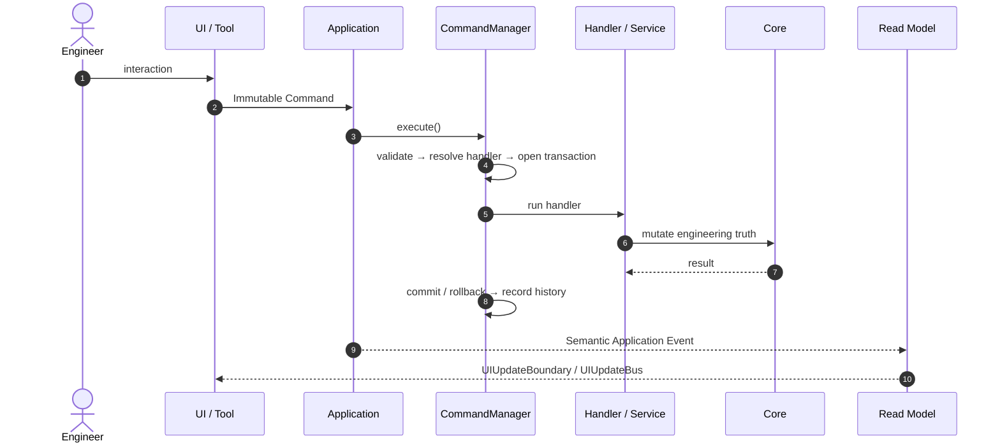
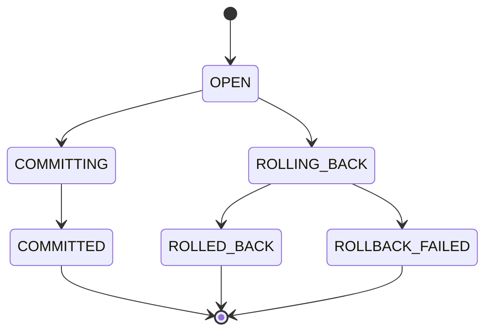
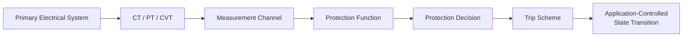
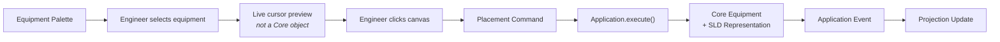
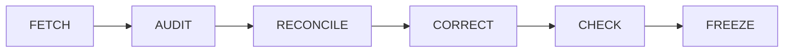

<p align="center">
  
</p>

<h1 align="center">⚡ GridForge V2</h1>

<p align="center">
  <b>Power-System Digital Twin · Engineering · Simulation · Automation</b>
</p>

<p align="center">
  <i>By Engineers. For Engineers.<br>One Platform. Infinite Engineering Possibilities.</i>
</p>

<p align="center">
  
  
  
  
</p>

<p align="center">
  <b>Author:</b> Subhendu Mishra
</p>

<p align="center">
  <a href="#-what-is-gridforge">Overview</a> ·
  <a href="#-architecture-at-a-glance">Architecture</a> ·
  <a href="#-the-mutation-pipeline">Pipeline</a> ·
  <a href="#-engineering-domains">Domains</a> ·
  <a href="#-repository-structure">Structure</a> ·
  <a href="#-architectural-rules">Rules</a> ·
  <a href="#-testing-philosophy">Testing</a>
</p>

---

## 🌐 What is GridForge?

**GridForge** is a Python-based power-system engineering platform for **creating, editing, validating, studying, simulating, documenting, and operating** digital representations of electrical power systems.

It is a **one-stop engineering environment for power-system engineers**, built on strict separation between:

| | | |
|---|---|---|
| 🧠 Engineering truth | 🎛️ Application orchestration | 🖱️ User interaction |
| 🎨 Graphical presentation | 📊 Studies & solvers | 🛡️ Protection |
| 🤖 Control & automation | 🌊 Dynamics | 💾 Persistence |
| 🔌 Plugins | 📄 Engineering documentation | |

> [!IMPORTANT]
> **GridForge V2 is not an SLD-only application.** The Single-Line Diagram is just *one* engineering projection of the underlying digital twin.

---

## 🏛️ Architecture at a Glance

> **Core owns engineering truth. Application owns orchestration. UI owns interaction and presentation.**


### One truth, three responsibilities

| Layer | Role | Owns |
|:---:|---|---|
| 🧠 **Core** | *Engineering Truth* | Model · Network · Topology · Terminals · Connections · Identities · Validation · Analysis · Protection · Measurement · Control · Dynamics · Studies · Solvers · Results |
| 🎛️ **Application** | *Orchestration* | Commands · Handlers · Transactions · Rollback/Commit · History · Undo/Redo · Lifecycle · Persistence · Study orchestration · Services · Events · Read models |
| 🖥️ **UI** | *Interaction & Presentation* | Widgets · Canvas · Rendering · Selection · Workspace state · Projections |

> [!NOTE]
> The **Core is headless** — no Qt, no QGraphics, no widgets, no canvas state, no UI controllers. The Application layer may call Core; Core never calls UI.

### ❌ What must never become a second engineering model

`The UI` · `The SLD` · `A renderer` · `A plugin`

---

## 🔁 The Mutation Pipeline

Every change to the engineering model follows a single, auditable path:



### CommandManager responsibilities

`1 Receive` → `2 Validate` → `3 Resolve handler` → `4 Open transaction` → `5 Execute` → `6 Commit / Roll back` → `7 Record history` → `8 Support undo/redo`

> [!TIP]
> **Failure invariant:** a failed command must never leave a partially mutated system — `S₀ → failed command → S₀`.

### Transaction lifecycle



### Commands & events

<table>
<tr>
<td valign="top" width="50%">

**📝 Immutable Commands**

`CreateBus` · `CreateTransformer` · `CreateBreaker` · `CreateLine` · `ConnectTerminals` · `UpdateEquipment` · `DeleteEquipment` · `PlaceEquipment` · `RunStudy` · `SaveProject` · `OpenProject` · `CloseProject`

Commands **never** manipulate widgets, bypass Application, or expose mutable Core state to UI code.

</td>
<td valign="top" width="50%">

**📣 Application Events**

`ElementCreated` · `ElementUpdated` · `ElementRemoved` · `TopologyChanged` · `ProjectLoaded` · `ProjectSaved` · `ProjectClosed` · `StudyStarted` · `StudyCompleted` · `ValidationChanged`

</td>
</tr>
</table>

---

## ⚙️ Engineering Domains

<details open>
<summary><b>🔌 Terminals, Connections & Topology</b></summary>

- **Terminals** are first-class engineering objects — electrical endpoints owned by their equipment, and the basis for connectivity, topology, and switching interpretation.
- **Connections & topology** are derived from authoritative terminal relationships via `TopologyManager`.
- **Graphical position does not establish electrical connectivity** unless the corresponding engineering relationship exists.
- A **Bus** is an authoritative engineering object with its own identity — not merely a graphical line, and not a generic derived topological node.

</details>

<details>
<summary><b>📊 Analysis · Power Flow · Short Circuit</b></summary>

```
Study / Engineering Analysis  →  Numerical Solver  →  Results
```

Power Flow lives under `core.analysis`. Short-circuit analysis consumes authoritative network and equipment data **without owning the model**.

</details>

<details>
<summary><b>🌊 Dynamics</b></summary>

A first-class study domain organized under `core/solver/dynamics/`. Dynamic initialization may use an operating point from a solved static study — but the dynamic model must **never silently replace** the persistent electrical truth.

</details>

<details>
<summary><b>🛡️ Protection</b></summary>



Protection decisions (`relay_id`, `function_code`, `function_id`, `decision`) remain **distinct from physical switching state**.

</details>

<details>
<summary><b>🤖 Control & Automation</b></summary>

Digital I/O, analog signals, timers, interlocks, ladder logic, and control sequences — all interacting with the model **only** through defined Application/domain interfaces.

</details>

---

## 🖼️ SLD Architecture

The Single-Line Diagram is a **presentation and interaction projection** — never the authoritative electrical model. It may hold symbols, positions, labels, routing, annotations, and interaction state, all separate from Core engineering truth.

### Placement workflow



> [!WARNING]
> **Graphical snapping is not electrical connectivity.** It must be committed through the Application command path.

---

## 🔌 Plugin Architecture

Plugins may contribute **equipment types · studies · canvases · tools · panels · renderers · reports · domain extensions** — but communicate exclusively through defined Core/Application contracts.

> A plugin is **an extension of GridForge, not an alternative architecture.**

---

## 💾 Persistence Architecture

Canonical project package: **`project.gridforge`**

```
project.gridforge/
├── manifest.json     # package / schema / version metadata
└── project.json      # canonical engineering + presentation data
```

**Lifecycle:** `New → Open → Save → Save As → Close`
**Events:** `ProjectLoaded` · `ProjectSaved` · `ProjectClosed`

> Runtime Qt and QGraphics objects are **never** persisted as project truth. Persistence stores **semantics**.

---

## 📁 Repository Structure

```
GridForge/
│
├── core/                     🧠 Authoritative engineering truth (headless)
│   ├── base/
│   ├── model/
│   ├── network/
│   ├── topology/
│   ├── analysis/
│   ├── solver/
│   │   └── dynamics/
│   ├── measurement/
│   ├── protection/
│   ├── control/
│   ├── validation/
│   └── results/
│
├── application/              🎛️ Orchestration boundary between UI and Core
│   ├── commands/
│   ├── handlers/
│   ├── services/
│   ├── transactions/
│   ├── history/
│   ├── lifecycle/
│   ├── studies/
│   ├── events/
│   ├── read_models/
│   └── persistence/
│
├── ui/                       🖥️ Interaction & presentation
│   ├── core/
│   ├── main_window/
│   ├── sld/
│   ├── control/
│   ├── protection/
│   ├── dynamics/
│   ├── studies/
│   ├── panels/
│   └── projections/
│
├── plugins/                  🔌 Contract-bound extensions
├── tests/                    🧪 Domain · Application · UI · Integration
└── docs/                     📄 Engineering documentation
```

---

## 📜 Architectural Rules

| # | Rule | # | Rule |
|:-:|---|:-:|---|
| 1 | **Core is authoritative** — one engineering model | 9 | **Qt stays out of Core** — Core remains headless |
| 2 | **Application is the UI↔Core boundary** | 10 | **Persistence stores semantics**, not UI objects |
| 3 | **Commands are immutable** | 11 | **Topology is derived** from engineering relationships |
| 4 | **Transactions are explicit** — commit/rollback | 12 | **Protection decisions ≠ switching state** |
| 5 | **Undo/redo belong to Application** | 13 | **Studies are Application-orchestrated** |
| 6 | **SLD is a projection**, not truth | 14 | **Read models are not Core** |
| 7 | **Renderer is read-only** with respect to Core | 15 | **Workflows are auditable end-to-end** |
| 8 | **Plugins use contracts** — no bypassing Application | | |

---

## 🚫 Forbidden Architectural Paths

```
❌  UI ───────────────► Core mutation
❌  SLD ──────────────► Core mutation
❌  Renderer ─────────► Core mutation
❌  Controller ───────► Core mutation
❌  Plugin ───────────► uncontrolled Core mutation
❌  Core ─────────────► Qt / UI
❌  Solver ───────────► independent engineering truth
❌  SLD geometry ─────► authoritative topology
❌  UI history ───────► independent undo/redo
```

---

## 🗂️ Engineering State Ownership

| Concern | Owner |
|---|:-:|
| Equipment identity & properties | 🧠 Core |
| Terminals · Connections · Topology | 🧠 Core |
| Domain validation & numerical calculations | 🧠 Core |
| Study orchestration | 🎛️ Application |
| Command execution · Transactions | 🎛️ Application |
| Undo/redo · Project lifecycle | 🎛️ Application |
| Persistence orchestration · Events · Read models | 🎛️ Application |
| UI interaction · Rendering · Selection | 🖥️ UI |
| Canvas geometry · User workspace state | 🖥️ UI / Projection |
| Plugin contributions | 🔌 Plugin *(via contracts)* |

---

## 🧪 Testing Philosophy

| Area | Coverage |
|---|---|
| 🧠 **Core Domain** | Model · Network/Topology · Analysis · Solver · Protection · Control · Dynamics |
| 🎛️ **Application** | Command · Transaction · History · Undo/Redo · Lifecycle · Persistence · Event |
| 🖥️ **UI / Integration** | Projection · Workflow Integration · Architecture Boundary · Regression |

Every major workflow — *create / edit / delete equipment, connections, undo/redo, save / open / close, run study, protection trip, control action, dynamic simulation* — requires **explicit contract coverage** of the complete path, not just isolated classes.

> [!CAUTION]
> A passing numerical solver does **not** prove that the complete engineering workflow works.

---

## 🧭 Development Philosophy

| Principle | Meaning |
|---|---|
| ⚖️ **Engineering truth before presentation** | The domain model precedes presentation semantics |
| 🧱 **Explicit boundaries before convenience** | Boundary shortcuts are treated as defects |
| 🔄 **Workflow before isolated classes** | A capability must work end-to-end |
| 🎯 **Determinism before convenience** | Identity, persistence, and results are reproducible |
| ✅ **Validation before freeze** | Architecture is checked against implementation before being frozen |

<details>
<summary><b>📋 Workflow Audit Checklist (14 steps)</b></summary>

1. Identify engineer intent
2. Identify UI entry point
3. Identify command
4. Identify Application entry point
5. Identify handler/service
6. Identify Core mutation
7. Identify transaction
8. Identify resulting event
9. Identify read model
10. Identify UI projection
11. Verify persistence
12. Verify undo/redo where applicable
13. Verify failure/rollback behavior
14. Verify no boundary violation

</details>

### 🔧 Architectural Reconciliation



> When old and new architectures conflict, **the current frozen V2 architecture takes precedence.**

---

## 🎯 Guiding Principle

> **One authoritative engineering truth, one controlled application boundary, multiple specialized engineering workflows and projections.**

| | |
|---|---|
| **CORE** | Engineering Truth |
| **APPLICATION** | Orchestration + Commands + Transactions + Lifecycle + Studies |
| **UI** | Interaction + Presentation + Projection |
| **WORKFLOWS** | End-to-End Engineering Execution |
| **PLUGINS** | Contract-Bound Extensions |
| **PERSISTENCE** | Reproducible Project State |

The goal is not merely to make the software *function* — it is to make every engineering action **traceable, deterministic, auditable, reversible where applicable, and architecturally consistent**.

---

## 🙅 What GridForge Is Not

- ❌ Merely an SLD drawing application
- ❌ Merely a numerical solver
- ❌ Merely a protection calculator
- ❌ Merely a simulation engine
- ❌ Merely a control-logic editor
- ❌ A collection of disconnected engineering tools
- ❌ A GUI wrapped around an unrelated calculation library
- ❌ A system where graphical state is treated as engineering truth

<br>

<p align="center">
  <b>GridForge is an integrated engineering platform<br>built around one authoritative digital-twin model.</b>
</p>

---

<p align="center">
  <sub>⚡ GridForge V2 — Architectural Baseline Document · Author: Subhendu Mishra</sub>
</p>
