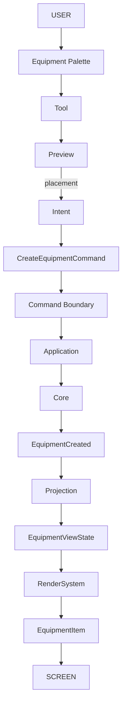
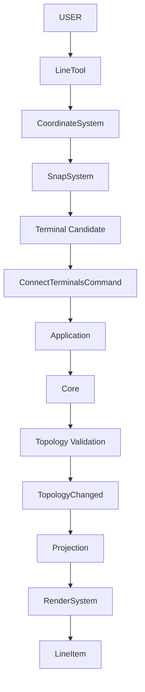
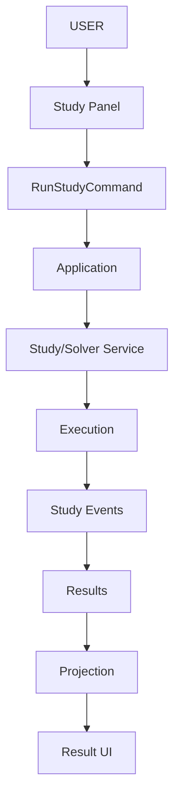
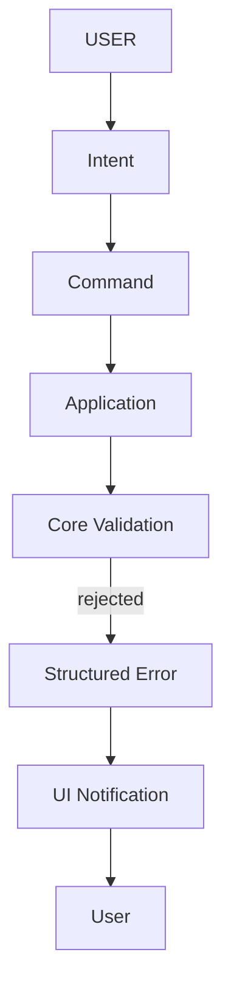

# GridForge V2 — UI Architecture

> **Status:** Frozen Architecture Contract
> **Scope:** `ui/` and all UI-facing integration points
> **Framework:** PySide6
> **Application:** GridForge V2

---

## Table of Contents

| Part | Topic | Sections |
|------|-------|----------|
| **I** | [Foundations](#part-i--foundations) | 1–3 |
| **II** | [Contracts: Read, Write, Events](#part-ii--read-write-and-event-contracts) | 4–7 |
| **III** | [State, Identity, Projection](#part-iii--state-identity-and-projection) | 8–12 |
| **IV** | [Shell and Coordination](#part-iv--shell-and-coordination) | 13–14 |
| **V** | [Interaction and Tools](#part-v--interaction-and-tools) | 15–20 |
| **VI** | [Canvas and Rendering](#part-vi--canvas-and-rendering) | 21–25 |
| **VII** | [Selection, Panels, Workspace](#part-vii--selection-panels-and-workspace) | 26–29 |
| **VIII** | [Multi-Canvas and Synchronization](#part-viii--multi-canvas-and-synchronization) | 30–32 |
| **IX** | [Workflows](#part-ix--core-workflows) | 33–34 |
| **X** | [Validation, Errors, Notifications](#part-x--validation-errors-and-notifications) | 35–37 |
| **XI** | [Platform: Qt, Plugins, Registries](#part-xi--platform-qt-plugins-and-registries) | 43–49 |
| **XII** | [Undo, Async, Studies, Results, Projects](#part-xii--undo-async-studies-results-and-projects) | 38–42 |
| **XIII** | [Robustness and Edge Cases](#part-xiii--robustness-and-edge-cases) | 50–57 |
| **XIV** | [Quality: Performance and Testing](#part-xiv--quality-performance-and-testing) | 57–60 |
| **XV** | [Structure, Flows, and Rules](#part-xv--structure-flows-and-rules) | 61–69 |

---

# Part I — Foundations

## 1. Purpose

The GridForge V2 UI is the **presentation, interaction, visualization, workspace, and user-intent boundary** of the GridForge engineering platform.

**It provides:**

- Electrical SLD editing and visualization
- Equipment placement and editing
- Topology interaction
- Engineering property inspection
- Study and result presentation
- Project navigation
- Tools and interaction modes
- Dockable engineering panels
- Workspace management
- Plugin-based UI extension
- Command dispatch
- Selection and snapping
- Rendering and visual feedback

> **The UI does not own engineering truth.**
> The authoritative engineering state remains outside the UI, in the Application/Core architecture.

### Fundamental principle

> **UI asks. Application orchestrates. Core decides. Core reports. UI projects and displays.**

---

## 2. Prime Directive

### UI-001 — The UI is never an alternate Core

The UI must **never** become the authoritative owner of:

| | | |
|---|---|---|
| Buses | Terminals | Branches |
| Equipment | Electrical parameters | Topology |
| Connectivity | Protection settings | Study definitions |
| Solver state | Study results | Engineering validation |
| Project persistence | Engineering calculations | |

**Authoritative source:**

```text
Application
    ↓
Core
 ├── Model
 ├── Network
 ├── Topology
 ├── Studies
 ├── Results
 └── Engineering Rules
```

**The UI owns only:**

- Presentation State
- Interaction State
- Viewport State
- Workspace State
- Transient UI State

---

## 3. Canonical UI ↔ Core Architecture

The complete interaction architecture:

```text
                         USER
                           │
                  mouse / keyboard
                           │
                           ▼
┌──────────────────────────────────────────────────────┐
│                         UI                           │
│                                                      │
│  MainWindow · Shell / Workspace · Canvas · Panels    │
│  Toolbar · Tools · Selection                         │
└──────────────────────┬───────────────────────────────┘
                       │ User Intent
                       ▼
              ┌──────────────────┐
              │ Command Boundary │
              └────────┬─────────┘
                       ▼
              ┌──────────────────┐
              │   Application    │
              │  Commands        │
              │  Handlers        │
              │  Services        │
              │  Lifecycle       │
              └────────┬─────────┘
                       ▼
              ┌──────────────────┐
              │       CORE       │
              │  Model · Network │
              │  Topology        │
              │  Studies·Results │
              └────────┬─────────┘
                       │ Events
                       ▼
              ┌──────────────────┐
              │ Projection /     │
              │ Adapter          │
              └────────┬─────────┘
                       ▼
              ┌──────────────────┐
              │    View State    │
              └────────┬─────────┘
                       ▼
              ┌──────────────────┐
              │  RenderSystem    │
              │  Renderers       │
              │  GraphicsItems   │
              └────────┬─────────┘
                       ▼
                     CANVAS
```

This is the **canonical GridForge V2 UI execution model**.

---

# Part II — Read, Write, and Event Contracts

## 4. Golden Write Contract

Every persistent user action follows this path:

```text
USER
 ↓
Qt Event
 ↓
Widget / Canvas
 ↓
Tool / Controller
 ↓
User Intent
 ↓
Command
 ↓
Command Boundary
 ↓
Application Handler / Service
 ↓
Core
 ↓
Authoritative State Change
```

**Prohibited** — direct mutation from a widget:

```python
bus.voltage = 132   # ❌ never from the UI
```

**Correct** — round trip through the command boundary:

```text
PropertyEditor
 ↓
ChangeParameterCommand
 ↓
Application
 ↓
Core
 ↓
EquipmentChanged
 ↓
Projection
 ↓
PropertyEditor
```

---

## 5. Golden Read Contract

UI state is **derived** from authoritative state:

```text
Core
 ↓
Application / Projection
 ↓
ViewState
 ↓
UI Component
 ↓
Renderer
 ↓
Screen
```

UI components must **not** reconstruct engineering truth by inspecting arbitrary Core internals.

---

## 6. Golden Event Contract

Events communicate authoritative state changes.

```text
Core / Application
        ↓
      Event
        ↓
 UI Event Adapter
        ↓
    Projection
        ↓
    View State
        ↓
 UI Components
```

**Examples:**

`EquipmentCreated` · `EquipmentChanged` · `EquipmentRemoved` · `TopologyChanged` · `ProjectLoaded` · `ProjectSaved` · `StudyStarted` · `StudyProgressed` · `StudyCompleted` · `StudyFailed` · `StudyCancelled`

> A UI action succeeding is determined by **authoritative application/Core state** — not by the fact that the user clicked a button.

---

## 7. Commands vs Events

This distinction is **mandatory**.

| | Command | Event |
|---|---|---|
| **Meaning** | "I want this operation to happen." | "This authoritative state change happened." |
| **Direction** | UI → Application | Application/Core → UI |
| **Examples** | `CreateBusCommand`, `CreateLineCommand`, `DeleteEquipmentCommand`, `MoveEquipmentCommand`, `MoveSLDElementCommand`, `ConnectTerminalsCommand`, `DisconnectTerminalsCommand`, `ChangeParameterCommand`, `RenameEquipmentCommand`, `RotateEquipmentCommand`, `RunStudyCommand`, `SaveProjectCommand`, `OpenProjectCommand` | `BusCreated`, `EquipmentChanged`, `EquipmentRemoved`, `TopologyChanged`, `ProjectLoaded`, `StudyCompleted` |

Commands and events must **never** be treated as interchangeable.

---

# Part III — State, Identity, and Projection

## 8. Five UI State Domains

GridForge V2 explicitly separates five kinds of state.

| # | State | Owner | Contents |
|---|-------|-------|----------|
| 8.1 | **Domain** | Core / Application | Network, equipment, terminals, topology, electrical parameters, protection, studies, results, engineering rules |
| 8.2 | **Application** | Application layer | Current project, project lifecycle, active study, command execution, command history, execution state, application services |
| 8.3 | **Presentation** | UI / Application | SLD position, SLD rotation, symbol geometry, label placement, routing geometry, visibility, presentation metadata |
| 8.4 | **Interaction** | UI | Active tool, selection, dragging, connecting, placing, editing, previewing, measuring |
| 8.5 | **Viewport** | UI | Zoom, pan, camera, grid visibility, grid spacing, viewport size |

> Presentation state is persisted when required, but **never becomes electrical truth**.

---

## 9. SLD Contract

> The SLD is **not** the electrical model. It is an **editable visual projection** of the authoritative electrical model plus presentation/layout state.

| Concern | Owner |
|---------|-------|
| Electrical truth | Core |
| Presentation / layout | UI / Application presentation state |
| Screen | Canvas |

The SLD may be saved and restored. Saving SLD layout does **not** make the SLD authoritative over electrical topology.

---

## 10. UI Object Identity

Every UI representation of a Core object must use the Core object's **stable identity**.

```text
Core:  equipment_id = "BUS-8F3A..."
UI:    BusItem.domain_id = "BUS-8F3A..."
```

**Never** use as authoritative identity:

- `id(core_object)`
- Python object identity
- Qt object identity
- List index
- Scene index
- Graphics-item index
- Display name

> Python/Qt identity may be used internally as an optimization, but never as the cross-layer architectural identity.

**Stable identity is required for:** event routing · projection · persistence · undo/redo · reload · multi-canvas synchronization · future collaboration · incremental rendering.

---

## 11. UI Object ≠ Domain Object

```text
Core Bus
   │
   ▼
BusViewState
   │
   ▼
BusItem
```

| Never equal | |
|---|---|
| `BusItem` ≠ `Bus` | `LineItem` ≠ `Line` |
| `TransformerItem` ≠ `Transformer` | `BreakerItem` ≠ `Breaker` |

A GraphicsItem **may** contain `domain_id`, geometry, visual state, and interaction state.
It **must not** become a shadow engineering model.

---

## 12. Projection Layer

The projection layer explicitly translates authoritative application/Core state into UI-readable state.

```text
Core Object
     ↓
Projection Adapter
     ↓
View State
     ↓
Renderer
     ↓
GraphicsItem
```

**Example:**

```python
EquipmentViewState(
    id="TR-001",
    equipment_type="transformer",
    name="TR-01",
    position=world_position,
    rotation=rotation,
    status=status,
)
```

The renderer consumes **ViewState**. It does not interrogate arbitrary Core internals.

---

# Part IV — Shell and Coordination

## 13. MainWindow Contract

`MainWindow` is the **UI composition root**. It is intentionally thin.

| ✅ Responsibilities | ❌ Must not |
|---|---|
| Create the top-level Qt window | Call `network.add_bus(...)` |
| Establish the application UI lifetime | Set `bus.voltage = ...` |
| Receive application/UI context | Call `solver.solve(...)` |
| Receive `PluginContext` | Implement engineering calculations |
| Initialize shell composition | Implement topology |
| Connect top-level UI services | Create concrete tools directly |
| Manage menus/toolbars/docks through composition | Create renderer implementations directly |
| Provide UI context | Mutate Core |
| Initiate orderly shutdown | Become the application brain or a second Controller |

---

## 14. Controller Contract

The Controller is the **UI/Application coordination boundary** — a facade, not another Core.

| ✅ May coordinate | ❌ Must not implement |
|---|---|
| Commands | Electrical calculations |
| Application actions | Topology algorithms |
| Project operations | Rendering |
| UI state | Snapping algorithms |
| Tool requests | Coordinate transformations |
| Selection state | Concrete tool behavior |
| Application services | Core business rules |

---

# Part V — Interaction and Tools

## 15. Interaction Architecture

The interaction system owns human input processing.

```text
Qt Input
   ↓
InteractionManager
   ↓
Active Tool
   ↓
Intent
   ↓
Command
```

**May manage:** mouse input · keyboard input · gestures · tool activation · tool sessions · interaction modes · transient previews · selection interaction · snapping · coordinate conversion.

**May not** directly mutate Core.

---

## 16. Tool Architecture

```text
Controller
     ↓
InteractionManager
     ↓
ToolManager
     ↓
Tool Registry
     ↓
Tool Instance
```

| Component | Responsibility |
|-----------|----------------|
| **InteractionManager** | Owns input routing |
| **ToolManager** | Owns tool lifecycle |
| **Tool Registry** | Owns registration/discovery |
| **Tool** | Owns interaction behavior |
| **Controller** | Requests/coordinates tool activation |

> The ToolManager must **not** become the registry. The registry must **not** become the lifecycle manager.

---

## 17. Tool Contract

| ✅ Tools may | ❌ Tools may not |
|---|---|
| Consume mouse events | `network.add_bus()` |
| Consume keyboard events | `equipment.parameter = value` |
| Create previews | `topology.connect(...)` |
| Query projection state | `solver.solve(...)` |
| Query selection | |
| Use snapping | |
| Convert coordinates | |
| Create commands | |
| Manipulate viewport state | |
| Manage transient interaction | |

**Correct:**

```text
mouseRelease → BusTool → CreateBusCommand → Application
```

---

## 18. Preview Contract

Preview objects are **explicitly non-authoritative**.

**Examples:** `BusPreview` · `LinePreview` · `TransformerPreview` · `ConnectionPreview` · `SelectionRectangle` · `SnapIndicator` · `MeasurementPreview`

**Preview state may contain:** cursor position · temporary geometry · orientation · snap candidate · routing preview · visual feedback.

> A preview must **never** be inserted into the authoritative network. Only a committed command creates persistent state.

---

## 19. Coordinate System Contract

The UI owns coordinate transformations.

```text
Screen  →  Scene / Viewport  →  World
```

```text
Mouse Position
      ↓
Screen → Scene
      ↓
Scene → World
      ↓
WorldPosition
      ↓
Command
```

**Core must never depend on:** `QPointF` · `QTransform` · `QGraphicsScene` · `QGraphicsView` · `QMouseEvent`

The domain receives **domain-neutral values**.

---

## 20. Snap Contract

Snapping is **UI interaction logic**.

**Snap types:** Grid · Terminal · Bus · Endpoint · Alignment · Orthogonal · Angle · Equipment Anchor

> Snap determines a **candidate**. Core determines whether the resulting operation is **legal**.

```text
SnapSystem
     ↓
candidate terminal T-001
     ↓
ConnectTerminalsCommand
     ↓
Core validation
     ↓
Topology change
```

The SnapSystem must never establish authoritative topology.

---

# Part VI — Canvas and Rendering

## 21. Canvas Contract

> The Canvas is an **editing and visualization surface**, not an electrical model.

| ✅ Canvas owns | ❌ Canvas does not own |
|---|---|
| Viewport | Network topology |
| Camera | Equipment ownership |
| Zoom / pan | Terminal connectivity |
| Grid presentation | Engineering validation |
| Visual items | Study state |
| Rendering | Solver state |
| Interaction | |
| Previews | |
| Selection presentation | |

---

## 22. CanvasPlugin Contract

`CanvasPlugin` is a **composition plugin**.

```text
Canvas
 ├── Scene
 ├── View
 ├── RenderSystem
 ├── InteractionManager
 ├── ToolManager
 └── PreviewLayer
```

**Must not:** own Core · create a second network · own topology · implement engineering calculations · bypass commands · become ToolManager · become InteractionManager · become RenderSystem · own project state.

---

## 23. Rendering Contract

Rendering is strictly presentation-oriented.

```text
Core/Application State
        ↓
Projection
        ↓
RenderSystem
        ↓
RendererRegistry
        ↓
Renderer
        ↓
GraphicsItem
        ↓
QGraphicsScene
```

| ✅ Renderers may | ❌ Renderers may not |
|---|---|
| Draw | Modify Core |
| Update geometry | Calculate engineering values |
| Choose visual representation | Validate topology |
| Display status | Create equipment |
| Display warnings | Run studies |
| Display selection | |
| Display result overlays | |

---

## 24. Renderer Identity

The RenderSystem maps visual representations through **stable domain IDs**.

```text
domain_id → RenderSystem → GraphicsItem
```

The mapping must remain stable across: reload · project reconstruction · Core event updates · multiple canvases · undo/redo · persistence.

> Python object identity is **not** the authoritative mapping.

---

## 25. Graphics Item Contract

A GraphicsItem is a **UI projection**.

- **May contain:** `domain_id`, geometry, visual state, interaction state
- **May emit** user-intent signals to the interaction/controller layer
- **Must not** directly mutate Core

```text
❌ Bad:      BusItem → core.bus.voltage = ...
✅ Correct:  BusItem → interaction/controller → ChangeParameterCommand
```

---

# Part VII — Selection, Panels, and Workspace

## 26. Selection Contract

Selection is **UI/application state**.

```text
User
 ↓
SelectionManager
 ↓
selected_ids
 ↓
Projection
 ↓
Graphics selection
```

Graphics selection is a visual projection — not the engineering model.

**Selection must not:** mutate Core · create equipment · change topology · modify electrical parameters.

---

## 27. Panel Architecture

Panels are specialized UI surfaces.

**Examples:** ToolPalette · ProjectExplorer · PropertyEditor · EquipmentConfigurator · ObjectInspector · CommandCenter · DiagnosticsPanel · AnalysisResults · ProtectionEditor · Settings · Navigator

| ✅ Panels may | ❌ Panels may not |
|---|---|
| Display projected state | Directly mutate Core |
| Accept user input | |
| Dispatch commands | |
| Display diagnostics | |
| Subscribe to events | |

---

## 28. Property Editor Contract

**Reading:**

```text
Selection → Projection → PropertyEditor
```

**Writing:**

```text
PropertyEditor
 ↓
ChangeParameterCommand
 ↓
Application
 ↓
Core
 ↓
EquipmentChanged
 ↓
Projection
 ↓
PropertyEditor
```

**Never:**

```text
QLineEdit.textChanged → Core object mutation   ❌
```

---

## 29. Workspace Contract

The workspace must support:

- Docking / undocking
- Resizing / collapsing
- Hiding / restoring
- Layout persistence
- Multiple panel instances where appropriate
- Workspace profiles
- Future multi-canvas arrangements

> Workspace state is UI/application presentation state. It must **not** redefine engineering topology.

---

# Part VIII — Multi-Canvas and Synchronization

## 30. Multi-Canvas Contract

Multiple canvases may represent: the same network · a different network scope · a different hierarchy level · a different SLD · a different study view — *unless explicitly defined as separate project/domain contexts.*

```text
✅ Correct                     ❌ Incorrect

     Core Network              Canvas A → Network A
    /     |     \              Canvas B → Network B
Canvas A  B  Canvas C          (when meant to show the same project)
```

---

## 31. Canvas Synchronization

**Core → UI:**

```text
Core Change → Event → Projection → Affected Canvas → Renderer
```

**UI → Core:**

```text
User Intent → Command → Application → Core Change
            → Event → Projection → Canvas
```

This closed loop prevents stale UI state.

---

## 32. Persistent Layout Changes

Persistent layout changes must cross an **explicit command boundary**.

```text
User drags Bus
       ↓
temporary visual movement
       ↓
release
       ↓
MoveSLDElementCommand
       ↓
Presentation/Layout State
       ↓
Event → Projection → Canvas
```

**Purely transient changes may remain local to the UI:** hover · rubber-band · cursor preview · selection rectangle · temporary snap indicator.

---

# Part IX — Core Workflows

## 33. Equipment Creation

```text
Equipment Palette
       ↓
Tool Selection
       ↓
Equipment Tool
       ↓
Preview
       ↓
Canvas Placement
       ↓
User Commit
       ↓
CreateEquipmentCommand
       ↓
Application Handler
       ↓
Core
       ↓
EquipmentCreated
       ↓
Projection
       ↓
EquipmentViewState
       ↓
Renderer
       ↓
EquipmentItem
```

> The `EquipmentItem` never creates authoritative equipment.

---

## 34. Connection Workflow

Connection interaction is **terminal-oriented**.

```text
LineTool
   ↓
SnapSystem
   ↓
Candidate Terminal
   ↓
User Commit
   ↓
ConnectTerminalsCommand
   ↓
Application
   ↓
Core
   ↓
Topology Validation
```

- **Core** determines whether the connection is legal.
- **UI** determines only the user's intended candidates.

---

# Part X — Validation, Errors, and Notifications

## 35. Validation Contract

| Category | Examples | Owner |
|----------|----------|-------|
| **UI validation** | Empty field · malformed text · invalid dialog input · unsupported UI selection | UI |
| **Domain validation** | Terminal already occupied · illegal topology · invalid equipment connection · invalid electrical parameter · invalid study configuration | Core / Application |

The UI **displays** the result of domain validation.

---

## 36. Error Contract

Raw Core exceptions must **not** be pushed directly into widgets.

```text
Core
 ↓
Application Error
 ↓
Command Result
 ↓
UI Notification
 ↓
User
```

The UI decides presentation (Toast · Dialog · Status Bar · Diagnostic Panel · Badge · Log · Inline Error). The Core decides validity.

---

## 37. Notification Contract

Notification presentation is **UI-owned**.

**Types:** Information · Warning · Error · Progress · Success

Structured application status is transformed into the appropriate UI presentation.

---

# Part XI — Platform: Qt, Plugins, and Registries

## 43. Qt Boundary

All UI Qt dependencies must pass through **`ui.core.qt`**.

```python
# ✅ Preferred
from ui.core.qt import QWidget, QObject

# ❌ Not throughout arbitrary UI modules
from PySide6.QtWidgets import QWidget
```

The Qt compatibility/binding boundary is the **only** permitted direct binding boundary.
**Core must never depend on PySide6.**

---

## 44. Plugin Architecture

Plugins extend controlled UI extension points:

Canvas · Panels · Toolbar · Status · Equipment UI · Studies · Renderers · Tools · Commands · Importers · Exporters

Every plugin receives a controlled `PluginContext`:

```python
PluginContext(
    application=...,
    command_manager=...,
    selection_manager=...,
    tool_manager=...,
    panel_registry=...,
    renderer_registry=...,
    notification_service=...,
    project_context=...,
    canvas_context=...,
)
```

> The context is a **dependency boundary**. Plugins must not receive unrestricted access to Core internals.

---

## 45. Plugin Lifecycle

```text
PluginManager
    ↓
discover → resolve dependencies → initialize → activate
    → deactivate → shutdown
```

`MainWindow` and `ShellPlugin` must **not** duplicate plugin lifecycle management.

---

## 46. Registry Contract

**Examples:** `PluginRegistry` · `ToolRegistry` · `PanelRegistry` · `RendererRegistry` · `CommandRegistry` · `ControllerRegistry`

**Registries provide:** registration · lookup · capability discovery · conflict detection · controlled lifecycle integration.

They must **not** become arbitrary global application-state stores.

---

## 47. Dependency Direction

**Preferred:**

```text
Qt
 ↓
UI Platform
 ↓
UI Components
 ↓
Controllers / Interaction
 ↓
Application Boundary
 ↓
Core
```

**Rendering:**

```text
Core/Application → Projection → UI View State
                 → RenderSystem → Renderer → GraphicsItem
```

**Forbidden dependencies:**

| | |
|---|---|
| Core → PySide6 | Renderer → Core mutation |
| Core → QGraphicsItem | GraphicsItem → Core mutation |
| Core → MainWindow | Tool → uncontrolled Core mutation |
| Core → Renderer | PropertyEditor → Core mutation |
| Core → UI Plugin | MainWindow → Solver |
| | ShellPlugin → Solver |

---

## 48. Threading Contract

Qt objects remain on the UI thread.

```text
Worker → Application Event → UI Thread → Widget Update
```

> Never update Qt widgets from solver or worker threads.

---

## 49. Lifecycle Contract

UI components must have explicit lifecycle semantics:

```text
create → initialize → attach → activate → update
       → deactivate → detach → dispose
```

Applies particularly to: plugins · tools · panels · renderers · canvas · project contexts · workspace components.

Critical application state must **not** be hidden inside uncontrolled global singletons.

---

# Part XII — Undo, Async, Studies, Results, and Projects

## 38. Undo / Redo

Undo/redo belongs to the **command/application** architecture.

```text
CommandManager
 ├── execute
 ├── undo
 ├── redo
 └── history
```

❌ Not `GraphicsScene.undo()`.
UI actions and non-UI application actions should be able to share the same command transaction model.

---

## 39. Long-Running Operations

Expensive operations must not block the UI thread:
project loading · large network rendering · study execution · result calculation · large imports/exports.

```text
UI → Command → Application Service
   → Worker / Execution Architecture → Core / Study / Solver
```

**UI receives:** `Started` · `Progress` · `Completed` · `Failed` · `Cancelled`

Qt widgets must only be updated from the UI thread.

---

## 40. Study UI

The UI does not own studies or solvers.

```text
StudyPanel → RunStudyCommand → Application
          → Study/Solver Service → Execution
```

**The UI displays:** Study Definition · Status · Progress · Warnings · Diagnostics · Results.
It **never** calls solver internals directly.

---

## 41. Result Visualization

Results are **authoritative application/Core data**.

```text
Load Flow Result
 ├── bus voltage
 ├── voltage angle
 ├── branch loading
 └── losses
```

The UI may display voltage labels, loading overlays, result tables, charts, and warning badges.

> Visual color or geometry is never itself the engineering result.

---

## 42. Project / File Contract

The UI requests project operations through application services:

`NewProjectCommand` · `OpenProjectCommand` · `SaveProjectCommand` · `SaveAsProjectCommand` · `CloseProjectCommand` · `ImportCommand` · `ExportCommand`

The UI must **not** implement project serialization. Persistence stays outside widgets and graphics items.

---

# Part XIII — Robustness and Edge Cases

## 50. Human Interaction Edge Cases

Every interactive tool must explicitly define behavior for each of the following.

<details>
<summary><strong>Show the full checklist (37 cases)</strong></summary>

**Mouse and keyboard**

- Click without selection
- Click outside canvas
- Double click
- Right click
- Middle click
- Mouse press without release
- Release outside canvas
- Drag cancellation
- Esc
- Delete
- Backspace

**Focus and context changes**

- Keyboard focus loss
- Tool switching during interaction
- Panel focus changes
- Selection changes during interaction
- Project close during interaction
- Project reload during interaction

**Command and Core outcomes**

- Command rejection
- Core validation failure
- Core event arriving during interaction
- Cancelled command
- Failed command

**Stale or missing resources**

- Object deletion during drag
- Object deletion during connection
- Stale domain ID
- Missing projection
- Missing renderer
- Missing plugin
- Missing tool

**Snapping and terminals**

- Invalid snap candidate
- Ambiguous snap candidate
- Disconnected terminal
- Occupied terminal

**Concurrency and lifecycle**

- Undo during transient interaction
- Redo during transient interaction
- Background study completion during editing
- Application shutdown during a tool session

</details>

> **Required rule:** Transient interaction may be cancelled safely at any time **without creating authoritative Core state**.

---

## 51. Tool Cancellation Contract

Every stateful tool must support cancellation (Placing · Connecting · Dragging · Editing · Measuring · Routing).

```text
Esc
 ↓
Tool.cancel()
 ↓
Preview discarded
 ↓
Transient interaction cleared
 ↓
No Core mutation
```

If a command has already been committed, cancellation is no longer a preview operation — **undo must use the command architecture**.

---

## 52. Focus Contract

Keyboard focus must never implicitly mutate engineering state (canvas, panel, property editor, search, and command-center focus).

Changing focus must **not**: change topology · commit partial engineering edits · activate arbitrary tools · create equipment.

Explicit commit/cancel semantics must be defined for editable fields.

---

## 53. Stale Projection Contract

A UI projection can become stale; the UI must not silently assume it remains valid.

If a `domain_id` no longer exists:

```text
Projection → missing object
          → remove/invalidate UI representation
          → diagnostic if necessary
```

The UI must **not** recreate the Core object itself.

---

## 54. Missing Renderer Contract

```text
Core object exists
       ↓
Projection exists
       ↓
Renderer unavailable
       ↓
Fallback / diagnostic representation
```

> The absence of a renderer must never imply the absence of the engineering object.

---

## 55. Plugin Failure Contract

If a plugin fails:

1. The failure must be **isolated**.
2. Plugin lifecycle state must be **recorded**.
3. The UI must **report diagnostics**.
4. Unrelated plugins must **remain operational** where possible.
5. Core state must **remain unaffected**.
6. Partial UI registration must be **cleaned up**.

> A failed UI plugin must never corrupt engineering state.

---

## 56. Multi-Canvas Synchronization

```text
          Core Object (domain_id)
          /        |        \
     Canvas A   Canvas B   Canvas C
```

- Each canvas owns its **own visual projection**.
- No canvas owns the Core object.
- A Core change must update **every** affected projection.

---

# Part XIV — Quality: Performance and Testing

## 57. Performance Contract

The UI must remain responsive during: large SLD rendering · zooming · panning · selection · project loading · large project reconstruction · topology changes · study execution · result visualization.

| Thread | Work |
|--------|------|
| **UI thread** | Interaction · rendering · widget updates |
| **Worker / execution** | Expensive computation · solver execution · large I/O · analysis |

---

## 58. Testing Contract

**Unit-test:** Controller · Command wiring · InteractionManager · ToolManager · Tools · SelectionManager · SnapSystem · CoordinateSystem · Projection · RenderSystem · Renderer · Navigation · Workspace · Plugin lifecycle

**Integration-test:**

```text
UI Intent → Command → Application → Core
         → Event → Projection → UI
```

---

## 59. Headless Core Requirement

Core tests must remain runnable **without** `QApplication`, `MainWindow`, `Canvas`, or PySide6 widgets.

```bash
pytest tests/core
```

UI tests should be able to substitute mocked Application/Core boundaries.

---

## 60. Equipment Extension Contract

Adding a new equipment type should **not** require repeatedly modifying central UI files.

```text
Equipment Plugin
 ├── equipment registration
 ├── projection
 ├── renderer
 ├── graphics item
 ├── tool
 ├── commands
 └── UI configuration
```

Extensions must use the established registries and command/projection boundaries.

---

# Part XV — Structure, Flows, and Rules

## 61. UI Architecture Tree

```text
ui/
├── core/
│   ├── controller.py
│   ├── command_manager.py
│   ├── selection_manager.py
│   ├── snap_system.py
│   ├── projection/
│   └── qt.py
├── controllers/
│   ├── canvas_controller.py
│   ├── command_controller.py
│   ├── interaction_controller.py
│   ├── navigation_controller.py
│   ├── selection_controller.py
│   └── tool_controller.py
├── canvas/
│   ├── coordinate_system.py
│   ├── graphics_view.py
│   ├── grid_scene.py
│   ├── grid_system.py
│   ├── interaction_manager.py
│   ├── preview_layer.py
│   └── render_system.py
├── tools/
│   ├── base/
│   ├── manager/
│   ├── registry/
│   └── implementations/
├── items/
├── renderers/
├── panels/
├── plugins/
├── workspace/
├── styling/
├── equipment/
├── connections/
├── topology/
├── sld/
├── model/
├── main_window.py
└── README.md
```

> Physical directory organization may evolve, but the **architectural responsibilities must remain stable**.

---

## 62. Canonical Equipment Creation Flow



---

## 63. Canonical Connection Flow



---

## 64. Canonical Study Flow



> The Canvas and panels never execute numerical solver internals.

---

## 65. Canonical Error Flow



The UI may offer a correction, but the correction must again become an explicit user intent and command.

---

## 66. What This Architecture Prevents

| Risk | Prevented by |
|------|--------------|
| GUI becoming the database | Authoritative Core state |
| `BusItem` becoming a second `Bus` | Projection identity |
| Canvas owning topology | Command boundary |
| Tool directly modifying Core | Interaction architecture |
| MainWindow becoming a God Object | Composition boundaries |
| Plugin bypassing architecture | `PluginContext` and registries |
| Study logic entering the GUI | Application/Solver boundaries |
| UI calculating engineering results | Result projection |
| Multiple canvases creating conflicting networks | Shared Core authority |
| Layout changes disappearing | Explicit Presentation State |
| Renderer becoming engineering logic | Renderer contract |
| Selection becoming domain state | SelectionManager contract |
| Preview becoming engineering state | Preview Layer contract |

---

## 67. Final Architecture

```text
                         USER
                           │
                           ▼
                    ┌─────────────┐
                    │  UI SHELL   │
                    └──────┬──────┘
                           │
          ┌────────────────┼────────────────┐
          ▼                ▼                ▼
       Panels           Canvas           Toolbar
          └────────────────┼────────────────┘
                           ▼
                ┌────────────────────┐
                │ INTERACTION LAYER  │
                │ Tools · Selection  │
                │ Snap · Coordinates │
                │ Interaction        │
                └─────────┬──────────┘
                        Intent
                          ▼
                ┌────────────────────┐
                │ COMMAND BOUNDARY   │
                └─────────┬──────────┘
                          ▼
                ┌────────────────────┐
                │ APPLICATION        │
                │ Commands·Handlers  │
                │ Services·Lifecycle │
                └─────────┬──────────┘
                          ▼
                ┌────────────────────┐
                │ CORE               │
                │ Model · Network    │
                │ Topology · Studies │
                │ Results            │
                └─────────┬──────────┘
                        Events
                          ▼
                ┌────────────────────┐
                │ PROJECTION         │
                └─────────┬──────────┘
                          ▼
                ┌────────────────────┐
                │ UI VIEW STATE      │
                └─────────┬──────────┘
                          ▼
                ┌────────────────────┐
                │ RENDER SYSTEM      │
                │ Registry·Renderers │
                │ Graphics Items     │
                └─────────┬──────────┘
                          ▼
                        SCREEN
```

---

## 68. Non-Negotiable Rules

The following rules are **frozen**:

1. UI never owns engineering truth.
2. UI never directly mutates Core.
3. Persistent user actions cross the command boundary.
4. Core/Application state changes return through events.
5. UI representations use stable domain IDs.
6. Graphics items are projections, not domain models.
7. SLD is not the electrical model.
8. Presentation state is distinct from engineering state.
9. Preview state is never authoritative.
10. Selection is UI/application state.
11. Snapping identifies candidates; Core validates topology.
12. Renderers never perform engineering calculations.
13. Tools never directly mutate Core.
14. MainWindow is a composition root, not an application brain.
15. PluginManager owns plugin lifecycle.
16. ToolManager owns tool lifecycle.
17. ToolRegistry owns tool registration/discovery.
18. Projection is an explicit architectural layer.
19. Qt types never cross into Core.
20. Core must remain headless.
21. Long-running operations never block the UI thread.
22. Undo/redo operates at the command/application level.
23. Multiple canvases never create duplicate Core networks.

---

## 69. The One Rule Above All Others

> **GridForge V2 UI must never become a second implementation of the Core.**

| Layer | Composed of |
|-------|-------------|
| **UI** | Presentation + Interaction + Projection + Workspace + Command Boundary + UI Platform |
| **Application** | Commands + Handlers + Services + Lifecycle + Execution Orchestration |
| **Core** | Engineering Truth + Topology + Engineering Rules + Studies + Results |

```text
                 UI
                  │
              asks / displays
                  │
                  ▼
            APPLICATION
                  │
             orchestrates
                  │
                  ▼
                CORE
                  │
               decides
                  │
                  ▼
               EVENTS
                  │
                  ▼
                 UI
```

**This is the frozen GridForge V2 UI ↔ Core contract.**
